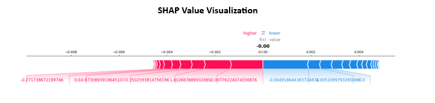

# Threat-Detection-System

## Project Overview
The "Threat Detection System" utilizes machine learning to enhance predictive threat intelligence in cybersecurity. Leveraging the NSL-KDD dataset, this system employs a RandomForest classifier to identify and predict various types of network intrusions and attacks, addressing the urgent need for dynamic and predictive security measures.

## Objective
To develop an effective machine learning model for predicting potential cybersecurity threats, focusing on pattern recognition, anomaly detection, and the potential to generalize to predict unseen attack patterns.

## Scope
This project encompasses the application of machine learning techniques to the NSL-KDD dataset for network intrusion detection, including comprehensive data preprocessing and rigorous model evaluation using metrics such as accuracy, precision, recall, and F1 score.

## Methodology
- Utilization of the NSL-KDD dataset, an improved version of KDD'99, to avoid redundant and biased records.
- Preprocessing steps including data cleaning, feature encoding, scaling, and selection.
- RandomForest classifier was chosen due to its effectiveness in classification tasks and robustness against overfitting.
- Evaluation of the model's performance through accuracy, precision, recall, F1 score, and a confusion matrix.

## Data Preprocessing and Analysis
Detailed preprocessing steps and exploratory data analysis were performed to ensure the data was ready for the machine learning model.

## Model Training and Evaluation
- Explanation of the RandomForest algorithm and its suitability for the project.
- The training process involves preprocessed data, handling of imbalanced data, and parameter tuning.
- Performance evaluation through visualizations like ROC and Precision-Recall curves, highlighting the model's strengths and areas for improvement.

## Results and Insights
- The model's performance was measured using various metrics, with visualizations provided for an in-depth analysis.
- Feature importance visualization and SHAP value visualization are included to indicate the model's reliance on different features.

## Visualizations Included
- Receiver Operating Characteristic (ROC) curves for multi-class classification.
- Precision-Recall (PR) curves for different classes.
- Feature importance and SHAP value visualizations.

## Discussion and Future Work
- Insights from the model's performance with respect to class-specific predictions.
- Identified limitations and recommendations for future enhancements, such as improved data collection, feature engineering, and exploration of different algorithms.

## Conclusion
The study highlights both the potential and the challenges of applying machine learning to cybersecurity, providing a foundation for future research in predictive threat intelligence.

## Visualizations
Visualizations are an integral part of the project and are used to communicate the model's performance and feature importance. Below are the included visualizations:

This README is intended to provide a high-level understanding of the project, its objectives, methodologies, and outcomes. For a more detailed explanation, refer to the project report and code within the repository.
